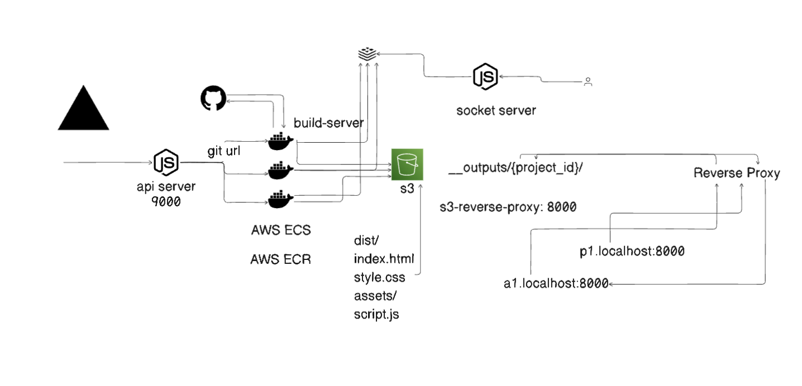

# DeployMate – Automated Deployment for React and Next.js Applications

**DeployMate** is an automated deployment pipeline for React and Next.js applications. It streamlines the deployment process by cloning code from GitHub and assigning subdomains for each deployment. DeployMate efficiently manages isolated environments for parallel deployments, significantly enhancing speed and efficiency, while incorporating real-time logging for improved data accessibility and monitoring.

## Pipeline Architecture


## Features

- **Automated Deployment**: Streamlines the deployment process for React and Next.js applications by automatically cloning code from GitHub and assigning subdomains.
- **Parallel Processing**: Enhances deployment speed by managing isolated Docker containers, enabling efficient parallel deployments that reduce downtime.
- **Scalable Infrastructure**: Utilizes AWS ECR and ECS for scalable deployment of Docker images, ensuring reliable performance under varying loads.
- **Integrated Build Streaming**: Facilitates seamless streaming of build files to S3 with an integrated S3 reverse proxy, optimizing storage and accessibility.

## Prerequisites

To set up **DeployMate**, you will need:

- **Node.js** (version 14 or higher)
- **Docker** (latest stable version)
- **AWS CLI** (configured with your AWS credentials)
- **Redis** (for real-time logging)
- **Socket.IO** (for real-time communication)

### Installing Dependencies

1. Clone the repository:

   ```bash
   git clone https://github.com/pranav687/deploy-mate
   cd deploy-mate
   ```

2. Set Up Environment Variables
Make sure to create a .env file in each of the server directories with the necessary environment variables.

3. Run api server:

   ```bash
   cd api-server
   npm install
   node index.js
   ```

4. Run the Build Server:

   ```bash
   cd build-server
   npm install
   node index.js
   ```
4. Run the Reverse Proxy:

   ```bash
   cd s3-reverse-proxy
   npm install
   node index.js
   ```


